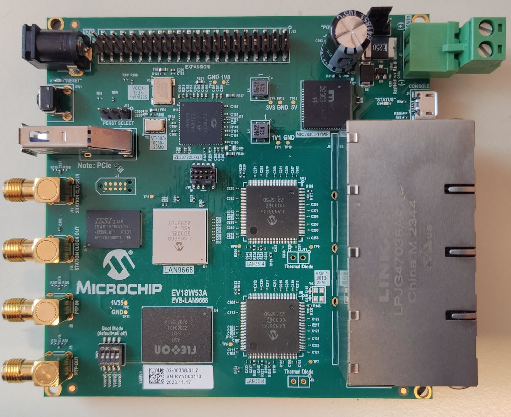
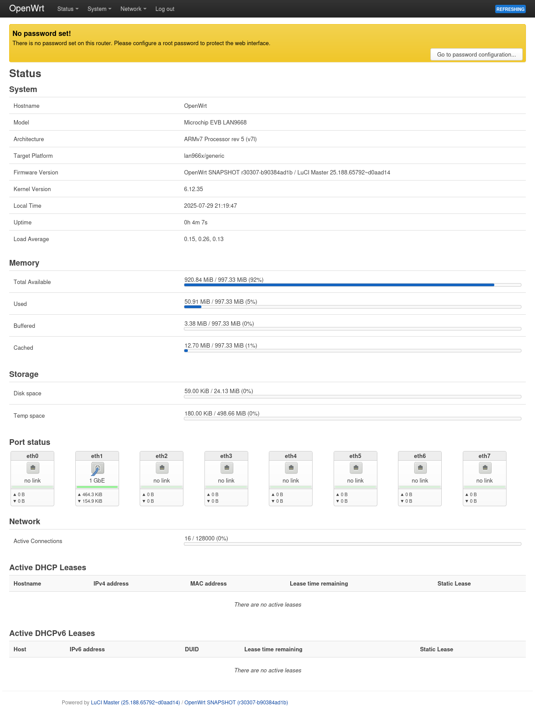

# OpenWrt at the Microchip EVB-LAN9668 board

The EVB-LAN9668 is an evaluation board designed to showcase the capabilities of Microchip’s LAN9668 Gigabit Ethernet switch, which supports Time-Sensitive Networking (TSN) features for real-time industrial applications. It provides multiple Ethernet ports, integrated PHYs, and flexible connectivity options, making it ideal for developing and testing TSN-based networking solutions. This project not focuses TSN for now.

**Official Microchip links**
* Microchip EVB-LAN9668 page: https://www.microchip.com/en-us/development-tool/ev18w53a
* Microchip SDK: https://github.com/microchip-ung/mesa
* Microchip BSP documentation: https://microchip-ung.github.io/bsp-doc/
* Microchip bridge configuration documentation: https://microchip-ung.github.io/bsp-doc/bsp/2025.06-1/bridge_configuration.html

**Unofficial OpenWrt port**

This port of OpenWrt is unoffical and independent from Microchip. It turns out that the LAN966x mainline Linux support is there but Ethernet is not working. For that reason the OpenWrt source contains some patches that Microchip provided (thanks to [HoratiuVultur](https://github.com/HoratiuVultur) for helping).
* OpenWrt source: https://github.com/AlbrechtL/openwrt/tree/microchip_lan966x_support
* LAN988x patches: https://github.com/AlbrechtL/openwrt/tree/microchip_lan966x_support/target/linux/lan966x/patches-6.12

**EVB-LAN9668**


## Current status

* [x] Boot OpenWrt
* [x] Ethernet switching incl. HW offloading
* [x] VLAN (untested)
* [ ] Fit image generation (WIP, used Microchip [imggen.rb](https://github.com/AlbrechtL/openwrt/blob/microchip_lan966x_support/target/linux/lan966x/image/imggen.rb))
* [ ] MMC flash (currently only boot from RAM is tested)
* [ ] Fix earlyprintk bug (new line seems to be not working)
* [ ] Upstream to OpenWrt

**LuCI screenshot**


## Development hints
* UART configuration 115200,8,N,1
* Boot via TFTP (in my setup the TFTP server is running at 192.168.2.1)

### u-boot preparation
To boot via TFTP the u-boot needs to be configured.

```
m => setenv ipaddr 192.168.2.10
m => saveenv
```

### Boot from u-boot

**Get fit image `fit.itb` via TFTP**
```
m => tftpboot 192.168.2.1:fit.itb
```
**Set bootargs (correct console and earlyprintk) and boot**
```
m => setenv bootargs console=ttyGS0,115200 root=/dev/ram0 loglevel=7 uio_pdrv_genirq.of_id=generic-uio earlyprintk
m => bootm 64000000#lan9668_ung8290_0_at_lan966x
```

### TIO usage
To automate the u-boot boot process via UART [tio](https://github.com/tio/tio) can be used. From version 4.0 `tio` has scripting support which automatically apply the u-boot commands. The script can be found [here](https://github.com/AlbrechtL/openwrt-lan9668/blob/main/boot_fit.lua).

```
tio --script-file boot_fit.lua /dev/ttyACM0
```

# Boot logs

**u-boot**
```
U-Boot 2019.04-linux4sam_6.2-icp (Sep 27 2022 - 16:19:43 +0200)

CPU: SAMA7
board type: 2
DRAM:  1022 MiB
MMC:   sdhci-host@e0830000: 0, emmc@e0830000: 1
Loading Environment from MMC... OK
In:    serial
Out:   serial
Err:   serial
Net:   eth0: port0
Warning: port1 (eth1) using random MAC address - 06:85:d1:f0:d1:9f
, eth1: port1
Warning: port2 (eth2) using random MAC address - c2:83:57:fa:ff:db
, eth2: port2
Warning: port3 (eth3) using random MAC address - 6e:8e:bf:c3:96:60
, eth3: port3
Warning: port4 (eth4) using random MAC address - 2e:8c:3d:c5:8c:43
, eth4: port4
Warning: port5 (eth5) using random MAC address - ca:8b:7e:80:73:d7
, eth5: port5
Warning: port6 (eth6) using random MAC address - 8a:89:fc:86:69:f4
, eth6: port6
Warning: port7 (eth7) using random MAC address - 76:71:68:d9:37:d2
, eth7: port7
Hit any key to stop autoboot:  0 
m => 
```

**Linux boot**
```
m => setenv bootargs console=ttyGS0,115200 root=/dev/ram0 loglevel=7 uio_pdrv_genirq.of_id=generic-uio earlyprintk
m => tftpboot 192.168.2.1:fit.itb
port1 Waiting for PHY auto negotiation to complete..... done
Using port1 device
TFTP from server 192.168.2.1; our IP address is 192.168.2.10
Filename 'fit.itb'.
Load address: 0x64000000
Loading: #################################################################
	 #################################################################
	 #################################################################
	 #################################################################
	 #################################################################
	 #################################################################
	 #################################################################
	 #################################################################
	 #################################################################
	 ##########
	 1.3 MiB/s
done
Bytes transferred = 8720379 (850ffb hex)
m => bootm 64000000#lan9668_ung8290_0_at_lan966x
## Loading kernel from FIT Image at 64000000 ...
   Using 'lan9668_ung8290_0_at_lan966x' configuration
   Trying 'kernel' kernel subimage
     Description:  Kernel
     Type:         Kernel Image
     Compression:  uncompressed
     Data Start:   0x640000c8
     Data Size:    4785704 Bytes = 4.6 MiB
     Architecture: ARM
     OS:           Linux
     Load Address: 0x60208000
     Entry Point:  0x60208000
   Verifying Hash Integrity ... OK
## Loading ramdisk from FIT Image at 64000000 ...
   Using 'lan9668_ung8290_0_at_lan966x' configuration
   Trying 'ramdisk' ramdisk subimage
     Description:  Ramdisk
     Type:         RAMDisk Image
     Compression:  uncompressed
     Data Start:   0x64494a40
     Data Size:    3915776 Bytes = 3.7 MiB
     Architecture: ARM
     OS:           Linux
     Load Address: 0x68000000
     Entry Point:  unavailable
   Verifying Hash Integrity ... OK
   Loading ramdisk from 0x64494a40 to 0x68000000
## Loading fdt from FIT Image at 64000000 ...
   Using 'lan9668_ung8290_0_at_lan966x' configuration
   Trying 'fdt_lan9668_ung8290_0_at_lan966x' fdt subimage
     Description:  Flattened Device Tree
     Type:         Flat Device Tree
     Compression:  uncompressed
     Data Start:   0x644907b8
     Data Size:    16912 Bytes = 16.5 KiB
     Architecture: ARM
     Load Address: 0x67e00000
   Verifying Hash Integrity ... OK
   Loading fdt from 0x644907b8 to 0x67e00000
   Booting using the fdt blob at 0x67e00000
   Loading Kernel Image ... OK
   Using Device Tree in place at 67e00000, end 67e0720f

Starting kernel ...
[...]
```

**bootlog via dmesg**
```
[    0.000000] Booting Linux on physical CPU 0x0
[    0.000000] Linux version 6.12.35 (albrecht@aus-desktop) (arm-openwrt-linux-muslgnueabi-gcc (OpenWrt GCC 14.3.0 r30302-bce0ad5563) 14.3.0, GNU ld (GNU B
inutils) 2.42) #0 SMP Tue Jul 29 21:15:49 2025
[    0.000000] CPU: ARMv7 Processor [410fc075] revision 5 (ARMv7), cr=10c5387d
[    0.000000] CPU: div instructions available: patching division code
[    0.000000] CPU: PIPT / VIPT nonaliasing data cache, VIPT aliasing instruction cache
[    0.000000] OF: fdt: Machine model: Microchip EVB LAN9668
[    0.000000] Memory policy: Data cache writealloc
[    0.000000] cma: Reserved 16 MiB at 0x9f000000 on node -1
[    0.000000] Zone ranges:
[    0.000000]   Normal   [mem 0x0000000060200000-0x00000000901fffff]
[    0.000000]   HighMem  [mem 0x0000000090200000-0x000000009fffffff]
[    0.000000] Movable zone start for each node
[    0.000000] Early memory node ranges
[    0.000000]   node   0: [mem 0x0000000060200000-0x000000009fffffff]
[    0.000000] Initmem setup node 0 [mem 0x0000000060200000-0x000000009fffffff]
[    0.000000] On node 0, zone Normal: 512 pages in unavailable ranges
[    0.000000] OF: reserved mem: Reserved memory: No reserved-memory node in the DT
[    0.000000] percpu: Embedded 13 pages/cpu s21132 r8192 d23924 u53248
[    0.000000] pcpu-alloc: s21132 r8192 d23924 u53248 alloc=13*4096
[    0.000000] pcpu-alloc: [0] 0 
[    0.000000] Kernel command line: console=ttyGS0,115200 root=/dev/ram0 loglevel=7 uio_pdrv_genirq.of_id=generic-uio earlyprintk
[    0.000000] Unknown kernel command line parameters "earlyprintk", will be passed to user space.
[    0.000000] Dentry cache hash table entries: 131072 (order: 7, 524288 bytes, linear)
[    0.000000] Inode-cache hash table entries: 65536 (order: 6, 262144 bytes, linear)
[    0.000000] Built 1 zonelists, mobility grouping on.  Total pages: 261632
[    0.000000] mem auto-init: stack:all(zero), heap alloc:off, heap free:off
[    0.000000] SLUB: HWalign=64, Order=0-3, MinObjects=0, CPUs=1, Nodes=1
[    0.000000] rcu: Hierarchical RCU implementation.
[    0.000000] rcu: 	RCU event tracing is enabled.
[    0.000000] rcu: 	RCU restricting CPUs from NR_CPUS=4 to nr_cpu_ids=1.
[    0.000000] rcu: RCU calculated value of scheduler-enlistment delay is 10 jiffies.
[    0.000000] rcu: Adjusting geometry for rcu_fanout_leaf=16, nr_cpu_ids=1
[    0.000000] NR_IRQS: 16, nr_irqs: 16, preallocated irqs: 16
[    0.000000] rcu: srcu_init: Setting srcu_struct sizes based on contention.
[    0.000000] arch_timer: cp15 timer(s) running at 37.50MHz (virt).
[    0.000000] clocksource: arch_sys_counter: mask: 0xffffffffffffff max_cycles: 0x8a60dd6a9, max_idle_ns: 440795204056 ns
[    0.000002] sched_clock: 56 bits at 38MHz, resolution 26ns, wraps every 2199023255540ns
[    0.000024] Switching to timer-based delay loop, resolution 26ns
[    0.000936] Console: colour dummy device 80x30
[    0.001002] Calibrating delay loop (skipped), value calculated using timer frequency.. 75.00 BogoMIPS (lpj=375000)
[    0.001027] CPU: Testing write buffer coherency: ok
[    0.001110] pid_max: default: 32768 minimum: 301
[    0.001386] Mount-cache hash table entries: 2048 (order: 1, 8192 bytes, linear)
[    0.001417] Mountpoint-cache hash table entries: 2048 (order: 1, 8192 bytes, linear)
[    0.003125] CPU0: update cpu_capacity 1024
[    0.003153] CPU0: thread -1, cpu 0, socket 0, mpidr 80000000
[    0.005611] Setting up static identity map for 0x60300000 - 0x60300078
[    0.005963] rcu: Hierarchical SRCU implementation.
[    0.005976] rcu: 	Max phase no-delay instances is 1000.
[    0.006930] dyndbg: Ignore empty _ddebug table in a CONFIG_DYNAMIC_DEBUG_CORE build
[    0.007200] smp: Bringing up secondary CPUs ...
[    0.007236] smp: Brought up 1 node, 1 CPU
[    0.007252] SMP: Total of 1 processors activated (75.00 BogoMIPS).
[    0.007267] CPU: All CPU(s) started in SVC mode.
[    0.007442] Memory: 998276K/1046528K available (10240K kernel code, 581K rwdata, 2952K rodata, 1024K init, 190K bss, 30108K reserved, 16384K cma-reserve
d, 243712K highmem)
[    0.013871] VFP support v0.3: implementor 41 architecture 2 part 30 variant 7 rev 5
[    0.014327] clocksource: jiffies: mask: 0xffffffff max_cycles: 0xffffffff, max_idle_ns: 19112604462750000 ns
[    0.014366] futex hash table entries: 256 (order: 2, 16384 bytes, linear)
[    0.015340] pinctrl core: initialized pinctrl subsystem
[    0.017748] NET: Registered PF_NETLINK/PF_ROUTE protocol family
[    0.020644] DMA: preallocated 256 KiB pool for atomic coherent allocations
[    0.022809] No ATAGs?
[    0.027307] /soc/interrupt-controller@e8c11000: Fixed dependency cycle(s) with /soc/interrupt-controller@e8c11000
[    0.035669] at_xdmac e0068000.dma-controller: 1 channels, mapped at 0x(ptrval)
[    0.037070] iommu: Default domain type: Translated
[    0.037085] iommu: DMA domain TLB invalidation policy: strict mode
[    0.038102] SCSI subsystem initialized
[    0.038497] usbcore: registered new interface driver usbfs
[    0.038567] usbcore: registered new interface driver hub
[    0.038637] usbcore: registered new device driver usb
[    0.039098] pps_core: LinuxPPS API ver. 1 registered
[    0.039109] pps_core: Software ver. 5.3.6 - Copyright 2005-2007 Rodolfo Giometti <giometti@linux.it>
[    0.039141] PTP clock support registered
[    0.041974] clocksource: Switched to clocksource arch_sys_counter
[    0.049493] NET: Registered PF_INET protocol family
[    0.049938] IP idents hash table entries: 16384 (order: 5, 131072 bytes, linear)
[    0.053530] tcp_listen_portaddr_hash hash table entries: 512 (order: 0, 4096 bytes, linear)
[    0.053586] Table-perturb hash table entries: 65536 (order: 6, 262144 bytes, linear)
[    0.053619] TCP established hash table entries: 8192 (order: 3, 32768 bytes, linear)
[    0.053755] TCP bind hash table entries: 8192 (order: 5, 131072 bytes, linear)
[    0.054104] TCP: Hash tables configured (established 8192 bind 8192)
[    0.054442] MPTCP token hash table entries: 1024 (order: 2, 16384 bytes, linear)
[    0.054577] UDP hash table entries: 512 (order: 2, 16384 bytes, linear)
[    0.054659] UDP-Lite hash table entries: 512 (order: 2, 16384 bytes, linear)
[    0.055048] NET: Registered PF_UNIX/PF_LOCAL protocol family
[    0.056453] RPC: Registered named UNIX socket transport module.
[    0.056478] RPC: Registered udp transport module.
[    0.056486] RPC: Registered tcp transport module.
[    0.056493] RPC: Registered tcp-with-tls transport module.
[    0.056499] RPC: Registered tcp NFSv4.1 backchannel transport module.
[    0.056805] NetWinder Floating Point Emulator V0.97 (double precision)
[    0.058574] Trying to unpack rootfs image as initramfs...
[    0.058603] rootfs image is not initramfs (invalid magic at start of compressed archive); looks like an initrd
[    0.062286] workingset: timestamp_bits=14 max_order=18 bucket_order=4
[    0.063000] squashfs: version 4.0 (2009/01/31) Phillip Lougher
[    0.063763] jffs2: version 2.2 (NAND) (ZLIB) (RTIME) (c) 2001-2006 Red Hat, Inc.
[    0.064441] bounce: pool size: 64 pages
[    0.072157] io scheduler mq-deadline registered
[    0.072193] io scheduler kyber registered
[    0.072289] io scheduler bfq registered
[    0.077507] pinctrl-ocelot e2004064.pinctrl: driver registered
[    0.093269] Freeing initrd memory: 3824K
[    0.094519] random: crng init done
[    0.095918] brd: module loaded
[    0.103870] loop: module loaded
[    0.114089] mscc-miim e2004118.mdio: Cannot register MDIO bus (-517)
[    0.114506] CAN device driver interface
[    0.115073] MAC addr was not set, use random MAC
[    0.240037] usbcore: registered new interface driver usbtmc
[    0.240137] usbcore: registered new interface driver usb-storage
[    0.240296] usbcore: registered new interface driver usbserial_generic
[    0.240345] usbserial: USB Serial support registered for generic
[    0.240405] usbcore: registered new interface driver ftdi_sio
[    0.240459] usbserial: USB Serial support registered for FTDI USB Serial Device
[    0.240523] usbcore: registered new interface driver usb_serial_simple
[    0.240565] usbserial: USB Serial support registered for carelink
[    0.240604] usbserial: USB Serial support registered for flashloader
[    0.240642] usbserial: USB Serial support registered for funsoft
[    0.240680] usbserial: USB Serial support registered for google
[    0.240719] usbserial: USB Serial support registered for hp4x
[    0.240756] usbserial: USB Serial support registered for kaufmann
[    0.240794] usbserial: USB Serial support registered for libtransistor
[    0.240832] usbserial: USB Serial support registered for moto_modem
[    0.240871] usbserial: USB Serial support registered for motorola_tetra
[    0.240909] usbserial: USB Serial support registered for nokia
[    0.240947] usbserial: USB Serial support registered for novatel_gps
[    0.240986] usbserial: USB Serial support registered for owon
[    0.241025] usbserial: USB Serial support registered for siemens_mpi
[    0.241074] usbserial: USB Serial support registered for suunto
[    0.241122] usbserial: USB Serial support registered for vivopay
[    0.241161] usbserial: USB Serial support registered for zio
[    0.241236] usbcore: registered new interface driver usbtest
[    0.241696] atmel_usba_udc 200000.usb: MMIO registers at [mem 0xe0808000-0xe08083ff] mapped at 49e8678a
[    0.241766] atmel_usba_udc 200000.usb: FIFO at [mem 0x00200000-0x0027ffff] mapped at 973082d0
[    0.244537] printk: legacy console [ttyGS0] enabled
[    0.245503] g_serial gadget.0: Gadget Serial v2.4
[    0.245531] g_serial gadget.0: g_serial ready
[    0.245965] i2c_dev: i2c /dev entries driver
[    0.247750] device-mapper: ioctl: 4.48.0-ioctl (2023-03-01) initialised: dm-devel@lists.linux.dev
[    0.248065] sdhci: Secure Digital Host Controller Interface driver
[    0.248091] sdhci: Copyright(c) Pierre Ossman
[    0.248109] sdhci-pltfm: SDHCI platform and OF driver helper
[    0.248702] atmel_sha e006c000.crypto: version: 0x700
[    0.249667] atmel_sha e006c000.crypto: using dma0chan0 for DMA transfers
[    0.249772] atmel_sha e006c000.crypto: Atmel SHA1/SHA256/SHA224/SHA384/SHA512
[    0.250243] hid: raw HID events driver (C) Jiri Kosina
[    0.250481] usbcore: registered new interface driver usbhid
[    0.250507] usbhid: USB HID core driver
[    0.251495] GACT probability NOT on
[    0.251554] Mirror/redirect action on
[    0.253607] NET: Registered PF_INET6 protocol family
[    0.257498] Segment Routing with IPv6
[    0.257607] In-situ OAM (IOAM) with IPv6
[    0.257840] sit: IPv6, IPv4 and MPLS over IPv4 tunneling driver
[    0.258927] NET: Registered PF_PACKET protocol family
[    0.259068] Bridge firewalling registered
[    0.259142] can: controller area network core
[    0.259262] NET: Registered PF_CAN protocol family
[    0.259289] can: raw protocol
[    0.259316] can: broadcast manager protocol
[    0.259344] can: netlink gateway - max_hops=1
[    0.259478] 8021q: 802.1Q VLAN Support v1.8
[    0.259863] ThumbEE CPU extension supported.
[    0.259923] Registering SWP/SWPB emulation handler
[    0.319269] Microchip INDY Gigabit Quad PHY e2004118.mdio-mii:0f: nonexclusive access to GPIO for coma-mode
[    0.344576] clk: Disabling unused clocks
[    0.344659] PM: genpd: Disabling unused power domains
[    0.345150] RAMDISK: squashfs filesystem found at block 0
[    0.345192] RAMDISK: Loading 3822KiB [1 disk] into ram disk... done.
[    0.470333] VFS: Mounted root (squashfs filesystem) readonly on device 1:0.
[    0.472834] Freeing unused kernel image (initmem) memory: 1024K
[    0.473291] Run /sbin/init as init process
[    0.473318]   with arguments:
[    0.473329]     /sbin/init
[    0.473340]     earlyprintk
[    0.473351]   with environment:
[    0.473361]     HOME=/
[    0.473372]     TERM=linux
[    0.801800] init: Console is alive
[    1.065389] kmodloader: loading kernel modules from /etc/modules-boot.d/*
[    1.098407] kmodloader: done loading kernel modules from /etc/modules-boot.d/*
[    1.105832] init: - preinit -
[    1.975962] lan966x-switch e0000000.switch eth0: PHY [e2004118.mdio-mii:09] driver [Microchip INDY Gigabit Quad PHY] (irq=40)
[    1.977926] lan966x-switch e0000000.switch eth0: configuring for phy/qsgmii link mode
[    6.280768] loop0: detected capacity change from 0 to 64000
[    6.302011] loop0: detected capacity change from 64000 to 56320
[    6.303883] mount_root: overlay filesystem in /dev/loop0 has not been formatted yet
[    6.633275] EXT4-fs (loop0): mounted filesystem 89467f70-a561-4086-b846-fa1b8ba6ae74 r/w with ordered data mode. Quota mode: disabled.
[    6.634772] mount_root: overlay filesystem has not been fully initialized yet
[    6.638481] mount_root: switching to ext4 overlay
[    6.690627] urandom-seed: Seed file not found (/etc/urandom.seed)
[    6.791071] procd: - early -
[    7.465870] procd: - ubus -
[    7.534036] procd: - init -
[    8.426111] kmodloader: loading kernel modules from /etc/modules.d/*
[    8.473445] usbcore: registered new interface driver hso
[    8.476238] usbcore: registered new interface driver kaweth
[    8.500459] pegasus: Pegasus/Pegasus II USB Ethernet driver
[    8.500737] usbcore: registered new interface driver pegasus
[    8.527595] usbcore: registered new interface driver asix
[    8.529657] usbcore: registered new interface driver ax88179_178a
[    8.531383] usbcore: registered new interface driver dm9601
[    8.553251] usbcore: registered new interface driver MOSCHIP usb-ethernet driver
[    8.687768] PPP generic driver version 2.4.2
[    8.691505] NET: Registered PF_PPPOX protocol family
[    8.694945] usbcore: registered new interface driver smsc95xx
[    8.724910] kmodloader: done loading kernel modules from /etc/modules.d/*
[    9.892533] urngd: v1.0.2 started.
[   91.117537] lan966x-switch e0000000.switch eth0: PHY [e2004118.mdio-mii:09] driver [Microchip INDY Gigabit Quad PHY] (irq=40)
[   91.119786] lan966x-switch e0000000.switch eth0: configuring for phy/qsgmii link mode
[   91.153727] switch: port 1(eth0) entered blocking state
[   91.153807] switch: port 1(eth0) entered disabled state
[   91.153901] lan966x-switch e0000000.switch eth0: entered allmulticast mode
[   91.154404] lan966x-switch e0000000.switch eth0: entered promiscuous mode
[   91.452661] lan966x-switch e0000000.switch eth1: PHY [e2004118.mdio-mii:0a] driver [Microchip INDY Gigabit Quad PHY] (irq=40)
[   91.458817] lan966x-switch e0000000.switch eth1: configuring for phy/qsgmii link mode
[   91.493522] switch: port 2(eth1) entered blocking state
[   91.493614] switch: port 2(eth1) entered disabled state
[   91.493699] lan966x-switch e0000000.switch eth1: entered allmulticast mode
[   91.494190] lan966x-switch e0000000.switch eth1: entered promiscuous mode
[   91.677876] lan966x-switch e0000000.switch eth2: PHY [e2004118.mdio-mii:07] driver [Microchip INDY Gigabit Quad PHY] (irq=40)
[   91.681054] lan966x-switch e0000000.switch eth2: configuring for phy/qsgmii link mode
[   91.715053] switch: port 3(eth2) entered blocking state
[   91.715131] switch: port 3(eth2) entered disabled state
[   91.715226] lan966x-switch e0000000.switch eth2: entered allmulticast mode
[   91.738039] lan966x-switch e0000000.switch eth2: entered promiscuous mode
[   91.829029] lan966x-switch e0000000.switch eth3: PHY [e2004118.mdio-mii:08] driver [Microchip INDY Gigabit Quad PHY] (irq=40)
[   91.836058] lan966x-switch e0000000.switch eth3: configuring for phy/qsgmii link mode
[   91.865827] switch: port 4(eth3) entered blocking state
[   91.865906] switch: port 4(eth3) entered disabled state
[   91.866008] lan966x-switch e0000000.switch eth3: entered allmulticast mode
[   91.872880] lan966x-switch e0000000.switch eth3: entered promiscuous mode
[   92.002865] lan966x-switch e0000000.switch eth4: PHY [e2004118.mdio-mii:11] driver [Microchip INDY Gigabit Quad PHY] (irq=40)
[   92.006813] lan966x-switch e0000000.switch eth4: configuring for phy/qsgmii link mode
[   92.036658] switch: port 5(eth4) entered blocking state
[   92.036737] switch: port 5(eth4) entered disabled state
[   92.036831] lan966x-switch e0000000.switch eth4: entered allmulticast mode
[   92.062382] lan966x-switch e0000000.switch eth4: entered promiscuous mode
[   92.177250] lan966x-switch e0000000.switch eth5: PHY [e2004118.mdio-mii:12] driver [Microchip INDY Gigabit Quad PHY] (irq=40)
[   92.178903] lan966x-switch e0000000.switch eth5: configuring for phy/qsgmii link mode
[   92.210080] switch: port 6(eth5) entered blocking state
[   92.210159] switch: port 6(eth5) entered disabled state
[   92.210240] lan966x-switch e0000000.switch eth5: entered allmulticast mode
[   92.213434] lan966x-switch e0000000.switch eth5: entered promiscuous mode
[   92.332856] lan966x-switch e0000000.switch eth6: PHY [e2004118.mdio-mii:0f] driver [Microchip INDY Gigabit Quad PHY] (irq=40)
[   92.336989] lan966x-switch e0000000.switch eth6: configuring for phy/qsgmii link mode
[   92.370344] switch: port 7(eth6) entered blocking state
[   92.370431] switch: port 7(eth6) entered disabled state
[   92.370548] lan966x-switch e0000000.switch eth6: entered allmulticast mode
[   92.375515] lan966x-switch e0000000.switch eth6: entered promiscuous mode
[   92.507971] lan966x-switch e0000000.switch eth7: PHY [e2004118.mdio-mii:10] driver [Microchip INDY Gigabit Quad PHY] (irq=40)
[   92.524956] lan966x-switch e0000000.switch eth7: configuring for phy/qsgmii link mode
[   92.551292] switch: port 8(eth7) entered blocking state
[   92.551373] switch: port 8(eth7) entered disabled state
[   92.551468] lan966x-switch e0000000.switch eth7: entered allmulticast mode
[   92.552250] lan966x-switch e0000000.switch eth7: entered promiscuous mode
[   94.533165] lan966x-switch e0000000.switch eth1: Link is Up - 1Gbps/Full - flow control rx/tx
[   94.533394] switch: port 2(eth1) entered blocking state
[   94.533441] switch: port 2(eth1) entered forwarding state
```
